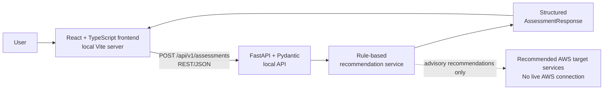
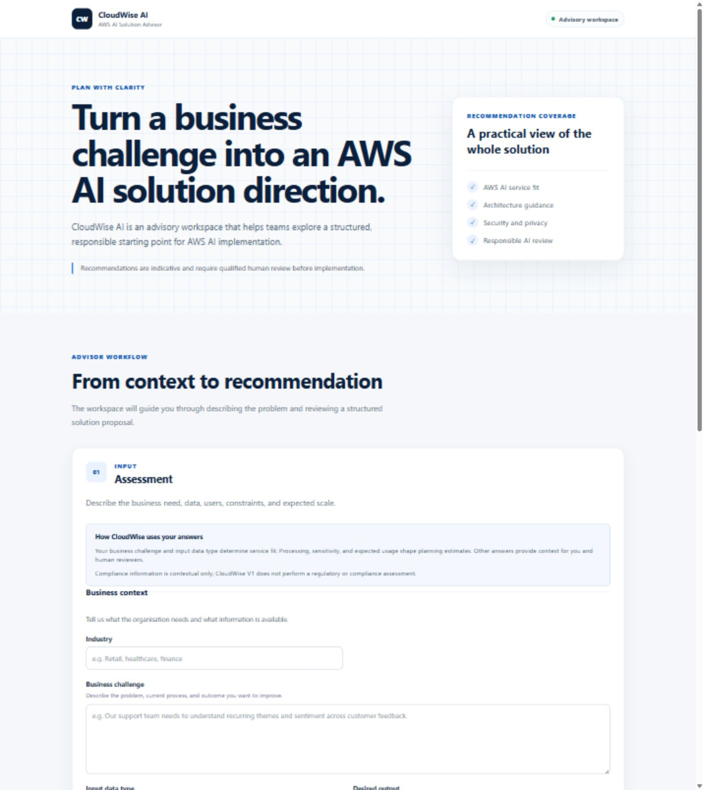
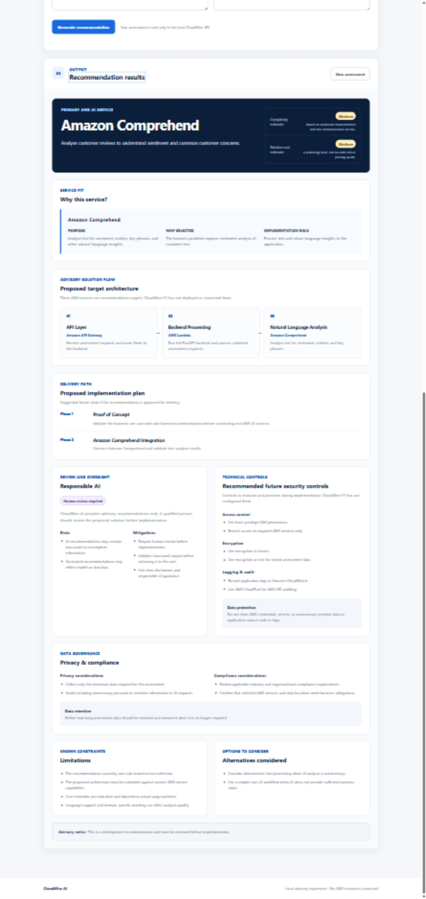

# CloudWise AI

CloudWise AI is a full-stack AWS AI solution advisory application that turns business requirements into structured AWS AI service and architecture recommendations.

Version 1 runs entirely in a local development environment. It uses deterministic, rule-based recommendation logic and does **not** call, provision, or deploy any AWS service.

## Why I Built This

AWS offers several AI and machine learning services, and choosing an appropriate service, architecture, security controls, governance considerations, and implementation approach can be difficult at the start of a project. CloudWise provides a structured assessment workflow that translates business requirements into an advisory recommendation for human review.

## Key Features

- Structured business assessment with client- and server-side validation
- Rule-based AWS AI service selection with service-specific rationale
- Architecture guidance and phased implementation recommendations
- Deterministic complexity and relative cost estimates
- Responsible AI, security, privacy, compliance, and retention guidance
- Known limitations, alternatives considered, and an advisory disclaimer
- Typed React-to-FastAPI integration using REST/JSON and native `fetch`
- Responsive results dashboard with loading, error, success, and reset workflows
- Restrictive CORS configuration for the local Vite frontend

## Supported AWS AI Recommendation Targets

These services are recommendation targets only. CloudWise does not connect to them in V1.

| AWS service | Example scenario |
| --- | --- |
| Amazon Comprehend | Analyse customer review text for sentiment and language insights. |
| Amazon Textract | Extract fields and tables from invoices or other documents. |
| Amazon Transcribe | Convert recorded speech or audio into text. |
| Amazon Rekognition | Detect objects and other visual features in images. |
| Amazon Polly | Turn written content into natural-sounding speech. |
| Amazon SageMaker | Build, train, and deploy a custom machine learning model. |
| Amazon Bedrock | Design a generative AI assistant using foundation models. It is also the current fallback recommendation when no more specific rule matches. |

## How It Works

1. A user describes the business problem, data, users, processing needs, sensitivity, scale, budget, and governance context.
2. React validates the form and submits a typed `AssessmentRequest` to the local API.
3. FastAPI and Pydantic validate the request.
4. The recommendation service evaluates the business challenge and input data type using ordered rules.
5. The service selects a recommendation target and builds service-specific metadata, architecture guidance, implementation phases, and deterministic estimates.
6. FastAPI returns a structured `AssessmentResponse`.
7. React renders the complete recommendation dashboard.

## Architecture



The runtime path is local: browser → FastAPI → deterministic recommendation service → browser. AWS services appear in the output as proposed solution components, not as dependencies used by CloudWise. See [Architecture details](docs/architecture.md) for responsibilities and integration boundaries.

## Technology Stack

| Area | Technologies |
| --- | --- |
| Frontend | React, TypeScript, Vite, CSS |
| Backend | Python, FastAPI, Pydantic, Uvicorn |
| Testing | Pytest, FastAPI TestClient, TypeScript compiler, Vite production build |
| Integration | REST/JSON, native browser `fetch`, local-development CORS |
| Development | Git, GitHub |

## Repository Structure

```text
cloudwise-ai/
├── backend/
│   ├── app/
│   │   ├── schemas/
│   │   │   └── assessment.py
│   │   ├── services/
│   │   │   └── recommendation_service.py
│   │   └── main.py
│   ├── tests/
│   └── requirements.txt
├── frontend/
│   ├── src/
│   │   ├── components/
│   │   ├── services/
│   │   ├── types/
│   │   ├── App.tsx
│   │   └── main.tsx
│   ├── .env.example
│   └── package.json
├── docs/
│   └── architecture.md
└── README.md
```

Generated directories such as `.venv/`, `frontend/node_modules/`, and `frontend/dist/` are excluded from version control.

## Running Locally

### Prerequisites

- Python 3.14.2 (the version used for local V1 verification)
- Node.js `^20.19.0` or `>=22.12.0`, with npm
- Git

No AWS account or credentials are required.

### Backend

From the repository root in Windows PowerShell:

```powershell
python -m venv .venv
.\.venv\Scripts\Activate.ps1
python -m pip install -r backend\requirements.txt
cd backend
python -m uvicorn app.main:app --reload
```

The API is available at `http://127.0.0.1:8000`, with interactive FastAPI documentation at `http://127.0.0.1:8000/docs`.

### Frontend

In a second terminal, from the repository root:

```powershell
cd frontend
npm ci
Copy-Item .env.example .env
npm run dev
```

Open `http://localhost:5173`. The example environment file sets `VITE_API_BASE_URL=http://127.0.0.1:8000`; this is also the frontend client's default API base URL.

## Example Assessment

One example input is:

- **Industry:** Retail
- **Business challenge:** Analyse customer feedback to understand sentiment.
- **Input data type:** Customer review text
- **Desired output:** Sentiment and language insights
- **Intended users:** Customer experience team
- **Processing type:** Batch

For this scenario, the expected recommendation target is **Amazon Comprehend**. This is an advisory example; CloudWise does not submit the data to Amazon Comprehend.

## Recommendation Output

Each completed assessment includes a recommended service and rationale, proposed architecture components, implementation phases, complexity, relative cost, responsible AI guidance, security controls, privacy and compliance considerations, limitations, alternatives, and a disclaimer.

The architecture section describes a possible AWS-oriented implementation. It does not represent infrastructure currently provisioned by this repository.

## Testing and Verification

The backend currently has **39 passing tests**, verified locally. Coverage includes:

- Request schema and API endpoint validation
- Health endpoint and restrictive local CORS behavior
- Ordered service-selection rules and the Bedrock fallback
- Service-specific metadata, architecture, phases, limitations, and alternatives
- Complexity and relative cost estimators
- Recommendation coherence across all supported targets

Run the backend suite from `backend/` with the virtual environment active:

```powershell
python -m pytest -q
```

The frontend currently uses compile and production-build verification; no automated frontend test suite is claimed.

```powershell
cd frontend
npx tsc --noEmit
npm run build
```

## Responsible AI

CloudWise recommendations identify risks, mitigations, and whether human review is required. Every response includes an advisory disclaimer. The application is decision support: it does not autonomously approve designs, provision infrastructure, or deploy AI systems.

## Security and Privacy

Generated recommendations can include least-privilege IAM, encryption in transit and at rest, CloudWatch logging, CloudTrail auditing, secret-handling, data minimisation, compliance, data-location, and retention considerations. These are proposed controls for a future implementation; CloudWise does not provision or enforce them.

## Current Limitations

- V1 uses deterministic, keyword-based recommendation rules.
- There is no live AWS service integration or AWS infrastructure.
- Cost levels are relative planning estimates, not live AWS pricing calculations.
- There is no persistent database or assessment history.
- There is no authentication or user management.
- Recommendations require qualified human review.
- AWS capabilities, regional availability, compliance fit, and pricing must be verified before implementation.

## Future Roadmap

- Enrich the recommendation rules and expand supported service coverage.
- Add an optional, carefully governed foundation-model reasoning layer.
- Add persistence, assessment history, and authentication.
- Export recommendation reports.
- Add automated frontend tests.
- Consider deployment when an appropriate cloud environment and cost model are available.

These are possible next steps, not committed or deployed features.

## Engineering Decisions

- **Backend as source of truth:** Recommendation rules and response construction remain in the service layer; routes stay thin.
- **Typed integration:** TypeScript request/response interfaces mirror the stable Pydantic API contract.
- **Centralised service metadata:** Service rationale and implementation guidance live in one maintainable backend mapping.
- **Separate deterministic estimators:** Complexity and relative cost are calculated independently from explicit workload signals.
- **Local-first development:** V1 demonstrates the full application workflow without cloud cost, credentials, or deployment dependencies.
- **Test-driven backend milestones:** Selection, metadata, estimates, coherence, API behavior, and CORS rules were developed with focused tests.

## Application Preview

### Assessment workflow

The local React interface introduces the advisory workflow and collects the business and solution context used by the recommendation engine.



### Recommendation results

A genuine local assessment for customer feedback analysis recommends Amazon Comprehend and presents the service rationale, planning estimates, architecture, and implementation path.



## License

This project is available under the terms in [LICENSE](LICENSE).
