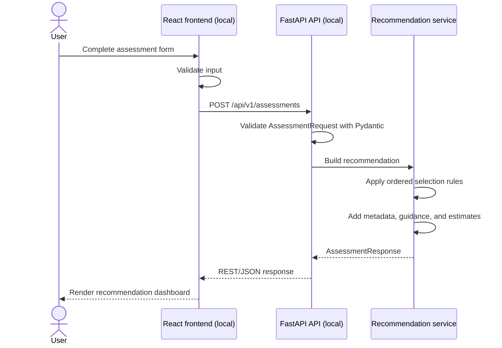

# CloudWise AI Architecture

CloudWise AI V1 is a local full-stack advisory application. It produces AWS-oriented recommendations but has no runtime connection to AWS.

## Local Runtime

The frontend defaults to `http://127.0.0.1:8000` and permits configuration through `VITE_API_BASE_URL`. FastAPI CORS is restricted to the local Vite origins `http://localhost:5173` and `http://127.0.0.1:5173` for assessment requests.

## Responsibilities

### Frontend

- Collects and validates assessment input.
- Sends a typed request using native browser `fetch`.
- Represents the complete response with TypeScript interfaces.
- Handles loading, validation, server, and unavailable-API states.
- Renders service rationale, architecture, delivery, governance, and planning guidance.
- Supports starting a new assessment without reloading the application.

The frontend does not contain recommendation rules.

### FastAPI and Pydantic

- Expose the health and assessment endpoints.
- Validate request and response data against the public API contract.
- Apply restrictive CORS settings for local frontend development.
- Delegate recommendation construction to the service layer.

### Recommendation Service

- Applies ordered keyword rules to the business challenge and input data type.
- Falls back to Amazon Bedrock when no more specific rule matches.
- Retrieves service-specific content from a central metadata mapping.
- Estimates complexity and relative cost with separate deterministic functions.
- Builds the structured response, including responsible AI, security, privacy, limitations, alternatives, and a disclaimer.

## Recommendation Targets Are Not Runtime Dependencies

The response may propose Amazon Comprehend, Textract, Transcribe, Rekognition, Polly, SageMaker, or Bedrock. It may also describe AWS services in a possible target architecture. Those names represent advisory output only.

V1 does not:

- Import an AWS SDK or use AWS credentials.
- Call AWS APIs or model endpoints.
- Provision API Gateway, Lambda, storage, logging, or AI services.
- Persist assessments to a database.
- Calculate live AWS pricing.

This boundary keeps local development free and makes the deterministic decision logic easy to test.

## API Flow

The frontend sends an `AssessmentRequest` containing business context, the desired outcome, users, processing type, sensitivity, expected usage, budget, and optional governance context. The API returns an `AssessmentResponse` containing:

- Problem summary and use-case category
- Recommended service metadata
- Proposed architecture components and implementation phases
- Complexity and relative cost levels
- Responsible AI, security, privacy, and compliance guidance
- Limitations, alternatives, and a disclaimer

The backend is the source of truth for this response. The frontend's types provide compile-time integration safety but do not replace server-side validation.

## Future Integration Boundary

A future version could place reviewed AWS integrations behind dedicated backend adapters. That work would require explicit authentication, authorisation, data-governance, observability, cost, and deployment decisions. The current route, schema, and service separation provide a clear boundary for such work without implying that it already exists.
